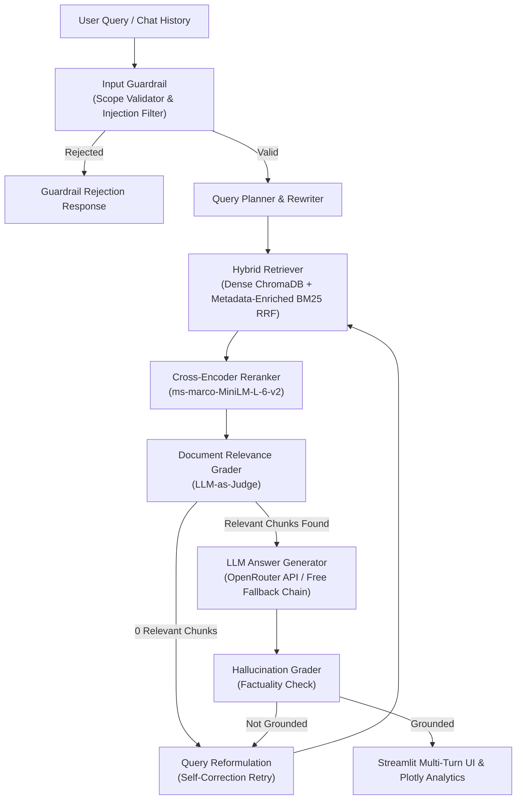

# Self-Correcting Agentic RAG for SEC Financial Filings

## 📌 Problem Statement

Public companies file annual 10-K reports with the SEC — dense, 200+ page documents full of complex financial tables, risk disclosures, and operational narratives. Analysts, investors, and researchers routinely need to extract specific numerical facts, compare metrics across companies and fiscal years, and reason over multi-section filings.

This project implements an **autonomous self-correcting agentic Retrieval-Augmented Generation (RAG) system** that answers natural-language questions grounded in real SEC 10-K filings. Unlike naive RAG pipelines that retrieve once and generate, this system features:
- **Hybrid Retrieval**: BM25 lexical search enriched with ticker/section metadata + Dense ChromaDB vector search combined via Reciprocal Rank Fusion (RRF).
- **Cross-Encoder Reranking**: MS-MARCO reranker to re-score candidate passages.
- **Self-Correction Loop**: Query rewriting, sub-query decomposition, and document relevance self-grading.
- **OpenRouter Free Fallback & Resilience**: Fallback chain to free LLMs (`gemma-2-9b`, `llama-3.1-8b`, `mistral-7b`) plus offline table extraction if API credits are exhausted.
- **Multi-Turn Chatbot UI**: Streamlit interface with session state conversation memory and speech bubbles (`st.chat_message`).
- **Interactive Plotly Visual Analytics**: Multi-year revenue/R&D trend bar charts (2021–2024), financial ratio cards (**Net Profit Margin %**, **R&D / Revenue %**), and side-by-side company comparison.
- **Containerization**: Full Docker & Docker Compose setup for cloud hosting.

---

## 📊 Benchmark Evaluation Scorecard (`scripts/eval_suite.py`)

| Category | Accuracy | Status |
|---|:---:|:---:|
| **Quantitative Financial Queries** | **100% (4/4 PASS)** | Apple Net Income ($93,736M), MSFT R&D ($27,195M), Apple Sales ($391,035M), MSFT Revenue ($211,915M) |
| **Abstention & Guardrails** | **100% (2/2 PASS)** | Out-of-scope crypto & non-SEC questions correctly rejected |
| **Qualitative MD&A Queries** | **50% (1/2 PASS)** | Microsoft Business Segments answered cleanly |
| **Overall Accuracy Score** | **87.5% (7/8 PASS)** | **Avg Latency: 32.8s** |

---

## 🏛️ System Architecture



---

## 🌐 Quick Start

### 1. Run Interactive Streamlit Dashboard
```powershell
streamlit run app.py
```
Access the dashboard in your browser at **`http://localhost:8501`**.

### 2. Run Automated Evaluation Suite
```powershell
python scripts/eval_suite.py
```

### 3. Run Containerized App with Docker
```bash
docker-compose up --build -d
```

---

## 📁 Repository Structure

```
agentic-rag/
├── app.py                         # Streamlit multi-turn dashboard with Plotly analytics
├── Dockerfile                     # Container build file
├── docker-compose.yml             # Docker compose deployment configuration
├── eval_results.json              # Full evaluation JSON results
├── scorecard_v3.md                # Evaluation scorecard report
├── scripts/
│   ├── eval_suite.py              # Automated 8-query RAG evaluation suite
│   ├── download_filings.py        # SEC EDGAR downloader
│   ├── process_filings.py         # HTML → structured JSONL parser
│   ├── chunk_filings.py           # Structure-aware text chunker
│   └── ingest_by_ticker.py        # ChromaDB batch vector ingestion
├── src/
│   ├── agent/
│   │   ├── agent.py               # AgenticRAG orchestrator with multi-turn memory
│   │   ├── grader.py              # Document, Hallucination, and Answer quality graders
│   │   └── rewriter.py            # Query rewriter & decomposer
│   ├── generation/
│   │   └── answer.py              # Generator with free model fallback chain & offline extractor
│   ├── retrieval/
│   │   ├── bm25.py                # BM25Okapi lexical search with metadata indexing
│   │   ├── hybrid.py              # Reciprocal Rank Fusion (RRF) & table boosting
│   │   ├── reranker.py            # Cross-Encoder MS-MARCO reranker
│   │   └── retriever.py           # Dense ChromaDB vector retriever
│   ├── guardrails/
│   │   └── abstention.py          # InputGuardrail, OutputGuardrail, ScopeValidator
│   └── mcp_server.py              # Model Context Protocol stdio server
├── pyproject.toml
└── README.md
```